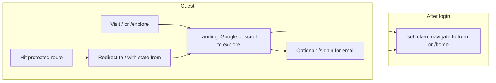

# Frontend Design – Edura Notes

This document is the single source of truth for the frontend: all pages and linking, application workflow, and detailed page/component descriptions. It is written to be self-explanatory and AI-parseable (tables, exact paths, and "Used by" / "Uses" relationships).

---

## Table of Contents

1. [Overview and Route Map](#1-overview-and-route-map)
2. [Navigation and Linking](#2-navigation-and-linking)
3. [Application Workflow](#3-application-workflow)
4. [Pages (Detailed)](#4-pages-detailed)
5. [Shared Components](#5-shared-components)
6. [Context and API](#6-context-and-api)
7. [Utils and Styles](#7-utils-and-styles)
8. [Conventions for AI Readability](#8-conventions-for-ai-readability)

---

## 1. Overview and Route Map

### Tech stack

- **React** 18, **Vite**, **React Router DOM**
- **Bootstrap** 5.3.2 (CSS + JS via `client/index.html`)
- **Edura theme**: `client/src/styles/edura.css` (CSS variables, layout, cards, sidebar, upload, search bar, secure viewer)
- **Entry**: `client/src/main.jsx` – `BrowserRouter` → `AuthProvider` → `App`
- **Routes**: `client/src/App.jsx`

### Route table

| Path | Component | Auth | Purpose |
|------|-----------|------|---------|
| `/` | Landing | Public (guest only; redirects to /home if authenticated) | Landing hero, Google sign-in, explore (users + public notes) |
| `/signup` | Redirect | Public | Redirects to `/signin` with `state.mode: 'signup'` |
| `/signin` | SignIn | Public | Email sign-in/sign-up tabs + optional Google |
| `/admin/login` | AdminLogin | Public | Admin Google sign-in; requires `user.role === 'admin'` |
| `/admin` | AdminRoute (layout) | Admin JWT | Wraps admin child routes; index redirects to `users` |
| `/admin/dashboard` | AdminDashboard | Admin | Stats (users, notes, storage); link to Users |
| `/admin/users` | AdminUsers | Admin | User list with search, table, pagination |
| `/admin/users/:userId` | AdminUserDetail | Admin | User detail: storage limit, profile/note listing, files table, delete user/notes |
| `/admin/view/note/:noteId` | AdminNoteView | Admin | Full-screen note viewer + "List on Explore" toggle |
| `/profile/:userId` | PublicProfile | Public | Public user profile: folders + public notes |
| `/view/note/:id` | PublicNoteView | Public | Full-screen public note view (no Layout) |
| `/explore` | Explore | Public | Search public profiles and public notes; pagination |
| `/home` | Homepage | User JWT (ProtectedRoute) | Browse own notes/folders; read-only sidebar |
| `/manage` | Manage | User JWT | Upload, folders sidebar (editable), notes grid/list, CRUD |
| `/notes/new` | Redirect | – | Redirects to `/manage` |
| `/notes/:id` | ViewNote | User JWT | Redirects to `/notes/:id/view` |
| `/notes/:id/view` | FullScreenPdfView | User JWT | Full-screen PDF/image viewer with zoom; Close → /home |
| `/notes/:id/edit` | EditNote | User JWT | Edit title, description, folder, visibility, optional file replace; Delete |
| `/dashboard` | DashboardRedirect | – | Redirects to `/home` if authenticated, else `/explore` |
| `*` | Redirect | – | Redirects to `/` |

### Route hierarchy

- **Admin area**: All routes under `/admin` (except `/admin/login`) are wrapped by `AdminRoute`, which renders `AdminLayout` and `<Outlet />` for nested routes. `AdminLayout` provides sidebar (Dashboard, Users) and top bar.
- **Protected user area**: `/home`, `/manage`, `/notes/:id`, `/notes/:id/view`, `/notes/:id/edit` are wrapped by `ProtectedRoute`. Unauthenticated access redirects to `/` with `state.from` set to the attempted location.

---

## 2. Navigation and Linking

### Layout (header and footer)

**File**: `client/src/components/Layout.jsx`

- **Brand**: "Edura Notes" – links to `/` when authenticated, `/explore` when guest.
- **When authenticated**: Home (`/home`), Manage (`/manage`), Explore (`/explore`), Public profile (`/profile/${user._id}`), user name (text), Sign Out (button → signOut then navigate `/`).
- **When guest**: Explore (`/explore`), Login / Sign up (`/signin`).
- **Footer**: Quick Links – Explore, Sign In, Home, Manage; Resources – #privacy, #terms.

### In-page links by destination

| From page | Link / action | To path |
|-----------|----------------|---------|
| Landing | View profile | `/profile/:userId` |
| Landing | View (note) | `/view/note/:id` |
| Landing | Profile (on note card) | `/profile/:userId` |
| SignIn | Explore | `/explore` |
| Explore | View profile | `/profile/:userId` |
| Explore | View (note) | `/view/note/:id` |
| Explore | Profile (on note card) | `/profile/:userId` |
| Homepage | Go to Manage | `/manage` |
| Homepage | View (NoteCard) | `/notes/:id/view` |
| Manage | View (NoteCard) | `/notes/:id/view` |
| Manage | Edit (NoteCard) | `/notes/:id/edit` |
| EditNote | Cancel / Back | `/manage` |
| EditNote | (after Save/Delete) | `/manage` |
| FullScreenPdfView | Close | `/home` |
| PublicProfile | View (note) | `/view/note/:id` |
| PublicNoteView | Back to profile | `/profile/:userId` or `/` |
| AdminLayout sidebar | Dashboard | `/admin/dashboard` |
| AdminLayout sidebar | Users | `/admin/users` |
| AdminDashboard | View all users | `/admin/users` |
| AdminUsers | View files | `/admin/users/:userId` |
| AdminUserDetail | ← Users | `/admin/users` |
| AdminUserDetail | View (note) | `/admin/view/note/:noteId` |
| AdminNoteView | Back to user | `/admin/users/:userId` or `/admin/users` |

---

## 3. Application Workflow

### Authentication flow

- **Guest**: Visits `/` or `/explore`. If they hit a protected route (`/home`, `/manage`, etc.), they are redirected to `/` with `state.from` set. Landing shows Google sign-in (and optional scroll to explore). Optional `/signin` for email sign-in/sign-up.
- **After login**: `setToken` is called; app navigates to `location.state.from` or `/home`.
- **Admin**: Visiting any `/admin/*` (except `/admin/login`) triggers `AdminRoute`: requires JWT and `user.role === 'admin'`. If not logged in → redirect to `/admin/login`; if not admin → redirect to `/home`.

### User flows (authenticated)

- **Browse own notes**: Home (`/home`) – folder sidebar (read-only), search, sort, view mode; notes grouped by folder. Links: View → `/notes/:id/view`, or go to Manage.
- **Manage notes**: Manage (`/manage`) – upload form (file, title, folder, description, visibility), storage bar, folder sidebar (editable), notes grid/list. View → full-screen viewer; Edit → EditNote; delete from card or EditNote.
- **Note lifecycle**: Upload on Manage (with Public/Private) → view at `/notes/:id/view` (zoom, no copy/drag) → edit/delete from Manage (Edit link) or EditNote page (Save/Cancel/Delete).

### Public / explore flow

- **Browse**: Landing (guest) or Explore – search public profiles and public notes (paginated). Profile link → PublicProfile; View note → PublicNoteView (read-only). PublicNoteView "Back to profile" → `/profile/:userId`.

### Admin flow

- **Admin login** (`/admin/login`) → Google only; role must be admin.
- **Dashboard** (`/admin/dashboard`) → Total users, total notes, total storage; "View all users" → `/admin/users`.
- **Users** (`/admin/users`) → Search, table (name, email, notes count, storage, created), "View files" → AdminUserDetail.
- **User detail** (`/admin/users/:userId`) → Toggle "List profile on Explore", set storage limit (MB), files table (select, delete selected or single; View → AdminNoteView; toggle "On Explore" per note). Modals: delete user, delete selected notes.
- **Admin note view** (`/admin/view/note/:noteId`) → Full-screen viewer + "List on Explore" checkbox; Back to user.

---

## 4. Pages (Detailed)

### Landing

- **Route**: `/`. **Auth**: Public; if authenticated, redirect to `/home`.
- **File**: `client/src/pages/Landing.jsx`
- **Purpose**: First screen for guests: hero with tagline, Google sign-in (when `VITE_GOOGLE_CLIENT_ID` set), and an Explore section (search public users and public notes with pagination).
- **Components used**: Layout; inline hero card; search form; two sections (Profiles, Public files) with cards and pagination.
- **Key UI**: Hero (title, subtitle, Google button, error alert); search input + Search button; Per-page select for profiles and files; profile cards (name, "View profile"); note cards (title, uploaded by, description snippet, View, Profile); Previous/Next pagination for both lists.
- **Data/API**: `GET /api/public/explore/users` (page, limit, search), `GET /api/public/explore/notes` (page, limit, search). Optional `POST /api/auth/google` (credential) for sign-in.
- **Outbound links**: `/profile/:userId`, `/view/note/:id`.

---

### Sign In

- **Route**: `/signin`. **Auth**: Public; if authenticated, redirect to `from` or `/home`.
- **File**: `client/src/pages/SignIn.jsx`
- **Purpose**: Email sign-in and sign-up (tabs) and optional Google sign-in. Entry from nav "Login / Sign up" or redirect from `/signup`.
- **Components used**: Layout; auth card; tabs (Sign in / Sign up); forms (email/password or name/email/password); optional Google button container.
- **Key UI**: Error alert; Google button (if configured); tabs; Sign in form (email, password) or Sign up form (name, email, password min 6); link to Explore.
- **Data/API**: `POST /api/auth/signin`, `POST /api/auth/signup`, optional `POST /api/auth/google`.
- **Outbound links**: `/explore`.

---

### Explore

- **Route**: `/explore`. **Auth**: Public.
- **File**: `client/src/pages/Explore.jsx`
- **Purpose**: Search and browse public profiles and public notes (paginated). For authenticated users, notes can exclude own (`excludeUserId`).
- **Components used**: Layout; title card; search form; Profiles section (cards + pagination); Public files section (cards + pagination).
- **Key UI**: Search input + Search button; Per-page for profiles and files; profile cards (name, "View profile"); note cards (title, uploaded by, description, View, Profile); pagination.
- **Data/API**: `GET /api/public/explore/users`, `GET /api/public/explore/notes` (with optional `excludeUserId`).
- **Outbound links**: `/profile/:userId`, `/view/note/:id`.

---

### Homepage

- **Route**: `/home`. **Auth**: Protected (user JWT).
- **File**: `client/src/pages/Homepage.jsx`
- **Purpose**: Browse own notes and folders in read-only mode. Filter by folder (sidebar), search, sort, switch grid/list. Use Manage to upload or edit.
- **Components used**: Layout; FolderList (readOnly); search bar; SortBySelect; ViewModeToggle; NoteCard (showActions=false, showFileName=false); per-page select; pagination.
- **Key UI**: Welcome heading; search (button/Enter applies); folder sidebar (multi-select, no add/rename/delete); heading (All Notes / Uncategorized / folder name / "N categories"); notes per page, Sort by, Grid/List; notes grouped by uncategorized then folders; empty state with "Go to Manage"; pagination.
- **Data/API**: `GET /api/folders` (optional search), `GET /api/notes` (folderIds, search, page, limit).
- **Outbound links**: `/manage`, `/notes/:id/view` (via NoteCard View).

---

### Manage

- **Route**: `/manage`. **Auth**: Protected.
- **File**: `client/src/pages/Manage.jsx`
- **Purpose**: Upload notes (PDF/images), manage folders (add/rename/delete in sidebar), and browse/edit/delete notes. Storage usage shown; upload has dropzone, title, folder, description, visibility (Public/Private).
- **Components used**: Layout; FolderList (readOnly=false); FolderTreeSelect (upload form); NoteCard (showActions=true, showFileName=true); SortBySelect; ViewModeToggle; upload form (dropzone, inputs, visibility select).
- **Key UI**: Storage bar (used/limit MB, progress; warning at limit); upload section: dropzone (choose file or drag), title, folder dropdown, description textarea, Visibility (Private/Public), Upload/Clear; search bar; folder sidebar (editable); notes grid/list with View/Edit/Delete; empty state "Upload your first note" scrolls to upload section; pagination.
- **Data/API**: `GET /api/folders`, `GET /api/notes`, `GET /api/notes/storage`; `POST /api/notes` (multipart); folder CRUD via FolderList.
- **Outbound links**: `/notes/:id/view`, `/notes/:id/edit`.

---

### Edit Note

- **Route**: `/notes/:id/edit`. **Auth**: Protected.
- **File**: `client/src/pages/EditNote.jsx`
- **Purpose**: Edit note metadata (title, description, folder, visibility) and optionally replace the file. Delete note with confirmation.
- **Components used**: Layout; FolderTreeSelect; form (title, description, folder, visibility, file input, Save/Cancel/Delete).
- **Key UI**: Title (required), description textarea, folder dropdown, Visibility (Private/Public), Replace file (optional input); current file name shown when no new file; Save Changes, Cancel, Delete note.
- **Data/API**: `GET /api/notes/:id`, `GET /api/folders`; `PUT /api/notes/:id` (JSON or FormData if file); `DELETE /api/notes/:id`.
- **Outbound links**: `/manage` (Cancel, after Save/Delete).

---

### View Note

- **Route**: `/notes/:id`. **Auth**: Protected.
- **File**: `client/src/pages/ViewNote.jsx`
- **Purpose**: Redirect only. Immediately redirects to `/notes/:id/view`.

---

### Full-screen PDF / Image View

- **Route**: `/notes/:id/view`. **Auth**: Protected.
- **File**: `client/src/pages/FullScreenPdfView.jsx`
- **Purpose**: Full-screen secure viewer for own note (PDF or image). No Layout. Top bar: title, zoom controls (0.5–3), Close. No right-click, no drag.
- **Components used**: SecureNoteViewerLazy (noteId, fullScreen, mimeType, fileName, zoom); wrapper with context-menu and drag prevention.
- **Key UI**: Bar (title, zoom −/value/+, Close link); content area with PDF pages or image.
- **Data/API**: `GET /api/notes/:id`, `GET /api/notes/:id/file` (blob via SecureNoteViewer).
- **Outbound links**: `/home` (Close).

---

### Public Profile

- **Route**: `/profile/:userId`. **Auth**: Public.
- **File**: `client/src/pages/PublicProfile.jsx`
- **Purpose**: Show a user's public profile: name and their public notes grouped by folder (or uncategorized). Search and sort/view mode.
- **Components used**: Layout; SortBySelect; ViewModeToggle; inline note cards and folder sections (no NoteCard component; custom render).
- **Key UI**: Heading "{name}'s profile"; search bar; Sort by, Grid/List; Uncategorized section (if any); folder sections with notes; "No public notes yet" when empty or no search match.
- **Data/API**: `GET /api/public/profile/:userId` (user, folders, notes).
- **Outbound links**: `/view/note/:id`.

---

### Public Note View

- **Route**: `/view/note/:id`. **Auth**: Public.
- **File**: `client/src/pages/PublicNoteView.jsx`
- **Purpose**: Full-screen read-only view of a public note. No Layout. Bar: title, zoom, "Back to profile" (or Home if no user).
- **Components used**: SecureNoteViewerLazy (publicNoteId, fullScreen, mimeType, fileName, zoom); wrapper with no-context-menu and no-drag.
- **Key UI**: Same as FullScreenPdfView but "Back to profile" link.
- **Data/API**: `GET /api/public/notes/:id`, `GET /api/public/notes/:id/file` (via viewer).
- **Outbound links**: `/profile/:userId` or `/`.

---

### Admin Login

- **Route**: `/admin/login`. **Auth**: Public.
- **File**: `client/src/pages/AdminLogin.jsx`
- **Purpose**: Admin entry: Google sign-in only. On success, backend returns user; frontend checks `user.role === 'admin'` and then sets token and navigates to `/admin`.
- **Components used**: None (no Layout); dark full-height container; card with Google button.
- **Key UI**: "Admin Login" title; error if not admin or API error; Google button.
- **Data/API**: `POST /api/auth/google`; role must be admin.
- **Outbound links**: On success → `/admin` (then index redirects to `/admin/users`).

---

### Admin Dashboard

- **Route**: `/admin/dashboard`. **Auth**: Admin.
- **File**: `client/src/pages/admin/AdminDashboard.jsx`
- **Purpose**: Overview stats: total users, total notes, total storage used. Link to Users list.
- **Components used**: AdminLayout (via AdminRoute); cards for stats.
- **Key UI**: Three cards (Total Users, Total Notes, Total Storage Used); "View all users" button.
- **Data/API**: `GET /api/admin/stats`.
- **Outbound links**: `/admin/users`.

---

### Admin Users

- **Route**: `/admin/users`. **Auth**: Admin.
- **File**: `client/src/pages/admin/AdminUsers.jsx`
- **Purpose**: Paginated list of users with search. Table: name, email, notes count, storage (used/limit), created, "View files".
- **Components used**: AdminLayout; table; search input; per-page select; pagination.
- **Key UI**: Search by name/email; Users per page; table; "View files" → user detail.
- **Data/API**: `GET /api/admin/users` (page, limit, search).
- **Outbound links**: `/admin/users/:userId`.

---

### Admin User Detail

- **Route**: `/admin/users/:userId`. **Auth**: Admin.
- **File**: `client/src/pages/admin/AdminUserDetail.jsx`
- **Purpose**: Single user: name, email; toggle "List profile on Explore"; set storage limit (MB); table of files (title, original name, type, size, Public, On Explore, Created) with select-all, delete selected, per-note View/Delete and "On Explore" checkbox. Modals: delete user, delete selected notes.
- **Components used**: AdminLayout; cards; table; modals.
- **Key UI**: Back "← Users"; user card (name, email, file count; Delete user if not self); Explore card (List profile on Explore); Storage limit (used/limit, input MB, Save); Files table (checkboxes, View, Delete, On Explore toggle); pagination; two modals (confirm delete user, confirm delete N notes).
- **Data/API**: `GET /api/admin/users/:userId` (notesPage, notesLimit); `PUT /api/admin/users/:userId` (storageLimitBytes, profileListedOnExplore); `PATCH /api/admin/notes/:noteId` (listedOnExplore); `DELETE /api/admin/notes` (body: noteIds); `DELETE /api/admin/users/:userId`.
- **Outbound links**: `/admin/users`, `/admin/view/note/:noteId`.

---

### Admin Note View

- **Route**: `/admin/view/note/:noteId`. **Auth**: Admin.
- **File**: `client/src/pages/admin/AdminNoteView.jsx`
- **Purpose**: Full-screen view of any user's note with "List on Explore" toggle. Same viewer behavior (no copy/drag).
- **Components used**: SecureNoteViewerLazy (adminNoteId, fullScreen, mimeType, fileName, zoom); bar with checkbox and Back.
- **Key UI**: Bar (title + user name, "List on Explore" checkbox, zoom, "Back to user"); content area.
- **Data/API**: `GET /api/admin/notes/:noteId`, `GET /api/admin/notes/:noteId/file`; `PATCH /api/admin/notes/:noteId` (listedOnExplore).
- **Outbound links**: `/admin/users/:userId` or `/admin/users`.

---

## 5. Shared Components

| Component | Path | Purpose | Used by |
|-----------|------|---------|---------|
| ProtectedRoute | `client/src/components/ProtectedRoute.jsx` | Renders children only when authenticated; else redirect to `/` with `state.from`; shows loading spinner while auth resolving | App (wraps Homepage, Manage, EditNote, ViewNote, FullScreenPdfView) |
| AdminRoute | `client/src/components/AdminRoute.jsx` | Requires user and `user.role === 'admin'`; renders AdminLayout + Outlet; else redirect to /admin/login or /home | App (wraps /admin routes) |
| Layout | `client/src/components/Layout.jsx` | Header (brand, nav, auth), main slot, footer | Landing, SignIn, Explore, Homepage, Manage, EditNote, PublicProfile |
| FolderList | `client/src/components/FolderList.jsx` | Folder tree (All Notes, Uncategorized, roots, subfolders); multi-select with cascading; when !readOnly: add folder, inline rename, delete | Homepage, Manage |
| FolderTreeSelect | `client/src/components/FolderTreeSelect.jsx` | Single-folder dropdown (tree, max depth 2) for upload or edit form | Manage, EditNote |
| NoteCard | `client/src/components/NoteCard.jsx` | Single note card: title, optional file name, folder badge, description, "Uploaded by", View/Edit/Delete; grid or list layout | Homepage, Manage |
| SortBySelect | `client/src/components/SortBySelect.jsx` | Dropdown: Sort by Name / Size / Time | Homepage, Manage, PublicProfile |
| ViewModeToggle | `client/src/components/ViewModeToggle.jsx` | Grid / List button group | Homepage, Manage, PublicProfile |
| SecureNoteViewer | `client/src/components/SecureNoteViewer.jsx` | Loads file by noteId, publicNoteId, or adminNoteId; PDF (react-pdf, no text layer) or image; zoom; no context menu/drag | Used via SecureNoteViewerLazy |
| SecureNoteViewerLazy | `client/src/components/SecureNoteViewerLazy.jsx` | React.lazy(SecureNoteViewer) with Suspense fallback; same props | FullScreenPdfView, PublicNoteView, AdminNoteView |

### Component props (reference)

- **ProtectedRoute**: `children`.
- **AdminRoute**: (uses Outlet; no direct props).
- **Layout**: `children`.
- **FolderList**: `folders`, `selectedFolderIds`, `onSelectionChange`, `onFoldersChange`, `readOnly`.
- **FolderTreeSelect**: `folders`, `value`, `onChange`, `id`, `labelId`, `className`, `size`, `disabled`.
- **NoteCard**: `note`, `onDeleted`, `viewMode` ('grid'|'list'), `showActions`, `folderName`, `showFileName`, `showVisibilityToggle`, `showUploadedBy`.
- **SortBySelect**: `sortBy`, `onSortByChange`.
- **ViewModeToggle**: `viewMode`, `onViewModeChange`.
- **SecureNoteViewer** / **SecureNoteViewerLazy**: one of `noteId` | `publicNoteId` | `adminNoteId`; `fullScreen`, `mimeType`, `fileName`, `zoom`; optional `pdfBlobUrl`.

---

## 6. Context and API

### AuthContext

- **File**: `client/src/context/AuthContext.jsx`
- **Exports**: `useAuth()` → `{ user, token, setToken, signOut, loading, isAuthenticated }`.
- **Behavior**: Holds `user`, `token`, `loading`. When token exists, calls `GET /api/auth/me` and syncs user; on failure clears token. `setToken(newToken, newUser)` writes to localStorage and state; `signOut()` clears.

### API client

- **File**: `client/src/api/client.js`
- **Functions**:
  - `api(url, options)`: JSON requests; prepends `/api` if relative; adds `Authorization: Bearer <token>` from localStorage when present; throws on !res.ok with body message.
  - `apiForm(url, formData, options)`: Same but no Content-Type (FormData); for file uploads.
  - `apiGetBlob(url)`: GET with token; returns `res.blob()`; throws on !res.ok.

---

## 7. Utils and Styles

### folderTree.js

- **File**: `client/src/utils/folderTree.js`
- **Exports**: `buildFolderTree(folders)` → tree with roots and nested children (sorted by name); `getFoldersInTreeOrder(folders)`; `flattenFolderTreeForSelect(tree)` for dropdowns; `getFolderIdAndDescendantIds(tree, folderId)` for cascading selection; `getMaxFolderDepth()` → 2.

### sortNotes.js

- **File**: `client/src/utils/sortNotes.js`
- **Export**: `sortNotes(notes, folders, sortBy)` where `sortBy` is `'name'` | `'size'` | `'time'`; returns new sorted array.

### edura.css

- **File**: `client/src/styles/edura.css`
- **Contents**: CSS variables (--edura-primary, --edura-text, --edura-card-bg, etc.); header/footer; auth page; cards; buttons (btn-edura); categories sidebar (folder list, chevrons, edit row); upload (dropzone, meta, description, actions); search bar; secure viewer (no-drag, fullscreen, watermark); fullscreen PDF bar and zoom; app-with-sidebar layout.

---

## 8. Conventions for AI Readability

- **Route table**: All paths and components are listed in §1 with exact path strings (e.g. `/notes/:id/view`) and auth type.
- **Linking**: §2 and §4 use tables: "From page" → "To path" and "Outbound links" so an AI can resolve "all links from page X" and "all links to path Y".
- **Components**: §5 uses a "Used by" column so an AI can find "where is FolderList used" and "what does Homepage use".
- **File paths**: Components and pages are referenced by path under `client/src/` (e.g. `client/src/pages/Manage.jsx`).
- **Workflow**: §3 uses short bullet flows and one mermaid diagram; no long paragraphs.
- **Props**: §5 lists props for shared components so an AI can infer required and optional arguments without reading source.
