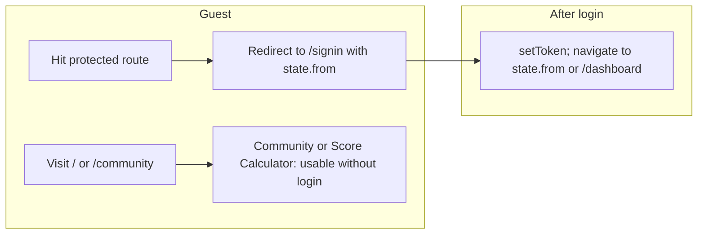

# Frontend Design – Edura Notes

This document is the single source of truth for the frontend: all pages and linking, application workflow, and detailed page/component descriptions. It is written to be self-explanatory and AI-parseable (tables, exact paths, and "Used by" / "Uses" relationships).

---

## Table of Contents

1. [Overview and Route Map](#1-overview-and-route-map)
2. [Navigation and Linking](#2-navigation-and-linking)
3. [Application Workflow](#3-application-workflow)
4. [Pages (Detailed)](#4-pages-detailed)
5. [Shared Components](#5-shared-components)
6. [Context and API](#6-context-and-api)
7. [Utils and Styles](#7-utils-and-styles)
8. [Conventions for AI Readability](#8-conventions-for-ai-readability)

---

## 1. Overview and Route Map

### Tech stack

- **React** 18, **Vite** 5, **React Router DOM** 6
- **Bootstrap** 5.3.2 (CSS + JS via `client/index.html`)
- **lucide-react** (icons), **recharts** (admin charts)
- **Edura theme**: `client/src/styles/edura.css` (CSS variables, light/dark via `[data-theme]`, layout, cards, sidebar, upload, search bar, secure viewer)
- **Entry**: `client/src/main.jsx` – `BrowserRouter` → `AuthProvider` → `App`
- **Routes**: `client/src/App.jsx`

### Route table

| Path | Component | Auth | Purpose |
|------|-----------|------|---------|
| `/` | `DashboardRedirect` | – | → `/dashboard` if authenticated, else `/community` |
| `/community` | Community | Public | Browse/join community spaces; view, vote, comment on notes |
| `/explore` | Redirect → `/community` | – | Legacy path from an earlier "Explore" page |
| `/score-calculator` | ScoreCalculator | Public | UGC NET score calculator (fully client-side, no API) |
| `/signup` | Redirect → `/signin` (`state.mode: 'signup'`) | – | — |
| `/signin` | SignIn | Public | Google + email sign-in/sign-up tabs |
| `/admin/login` | AdminLogin | Public | Admin sign-in; requires `user.role === 'admin'` |
| `/admin` | AdminRoute (layout) | Admin JWT | Wraps admin child routes; index redirects to `dashboard` |
| `/admin/dashboard` | AdminDashboard | Admin | Stats, charts, Community admin console |
| `/admin/users` | AdminUsers | Admin | User list with search, table, pagination |
| `/admin/users/:userId` | AdminUserDetail | Admin | User detail: storage limit, notes table, delete user/notes |
| `/admin/view/note/:noteId` | AdminNoteView | Admin | Full-screen note viewer + "List on Explore" toggle |
| `/profile/:userId` | PublicProfile | Public | Public user profile: badges, folders, public/community notes |
| `/view/note/:id` | PublicNoteView | Public | Full-screen public note view (no Layout) |
| `/dashboard` | Dashboard | User JWT (ProtectedRoute) | Browse own notes/folders; read-only sidebar |
| `/home` | Redirect → `/dashboard` | – | Legacy path from an earlier "Homepage" page |
| `/manage` | Manage | User JWT | Upload (file or Drive link), folders (editable), CRUD, bulk actions, Trash |
| `/notes/new` | Redirect → `/manage` | – | — |
| `/notes/:id/view` | FullScreenPdfView | User JWT | Full-screen PDF/image viewer with zoom |
| `/notes/:id/edit` | EditNote | User JWT | Edit title/description/folder/visibility, replace file or Drive link, Delete |
| `*` | Redirect → `/` | – | — |

**Removed since earlier versions of this doc:** the standalone `Explore.jsx`, `Homepage.jsx`, `ViewNote.jsx`, and `Landing.jsx` pages no longer exist. `Explore` was folded into `Community`; `Homepage` was replaced by `Dashboard`; `ViewNote` (a bare redirect to `/notes/:id/view`) and `Landing` were deleted outright — `/` now redirects straight to `/dashboard` or `/community` via `DashboardRedirect`.

### Route hierarchy

- **Admin area**: All routes under `/admin` (except `/admin/login`) are wrapped by `AdminRoute`, which renders `AdminLayout` and `<Outlet />` for nested routes (except `/admin/view/note/:noteId`, which renders standalone, full-screen).
- **Protected user area**: `/dashboard`, `/manage`, `/notes/:id/view`, `/notes/:id/edit` are wrapped by `ProtectedRoute`. Unauthenticated access redirects to `/signin` with `state.from` set to the attempted location.
- **Public area**: `/community` and `/score-calculator` require no authentication at all — both are fully usable by guests.

---

## 2. Navigation and Linking

### Layout (header and footer)

**File**: `client/src/components/Layout.jsx`

- **Brand**: "Notes Handling" — links to `/`.
- **Nav (always visible)**: Community (`/community`), Score Calculator (`/score-calculator`).
- **When authenticated**: + Public profile (`/profile/:userId`, only if `user._id`), avatar/name, a profile-settings button (opens `EditProfileModal`), dark-mode toggle, Sign Out.
- **When guest**: + dark-mode toggle, Sign In, Sign Up.
- **Footer Quick Links**: Community, Score Calculator, then My Files (`/manage`) + Public profile if signed in, or Sign In if guest. **Resources**: Privacy Policy / Terms of Service / Help Center (placeholder, non-functional).
- **Dark mode**: `useDarkMode()` hook in `Layout.jsx` persists to `localStorage['edura-theme']` and sets `document.documentElement.dataset.theme`; `edura.css` reacts to `[data-theme="dark"]` (not `prefers-color-scheme`).
- **Profile editing**: The settings button opens `EditProfileModal` (defined in `Layout.jsx`) — form for name, bio, and GitHub/LinkedIn/Twitter/website links; `PUT /api/auth/profile`.

### In-page links by destination

| From page | Link / action | To path |
|-----------|----------------|---------|
| Community | Select a space | `?space=<id>` (same route, query-param driven, no navigation) |
| Community | Select a note | `?note=<id>` (opens `SecureNoteModal` in place) |
| Community | Top Contributor card | `/profile/:userId` |
| Community (note card) | Author avatar/name | `/profile/:userId` |
| SignIn | "Explore public files" | `/community` |
| Dashboard | "Manage & Upload" | `/manage` |
| Dashboard | View (NoteCard) | `/notes/:id/view` |
| Manage | View (NoteCard) | `/notes/:id/view` |
| Manage | Edit (NoteCard) | `/notes/:id/edit` |
| EditNote | Cancel / after Save / after Delete | `/manage` |
| FullScreenPdfView | Close | `location.state.from` or `/dashboard` |
| PublicProfile | View (note) | `/view/note/:id` |
| PublicNoteView | Back to profile | `/profile/:userId` or `/` |
| AdminLayout sidebar | Dashboard / Users | `/admin/dashboard` / `/admin/users` |
| AdminUsers | "View files" | `/admin/users/:userId` |
| AdminUserDetail | View (note) | `/admin/view/note/:noteId` |
| AdminNoteView | Back to user | `/admin/users/:userId` or `/admin/users` |

---

## 3. Application Workflow

### Authentication flow

```mermaid
flowchart LR
  subgraph guest [Guest]
    A["Visit / or /community"]
    B["Hit protected route"]
    C["Redirect to /signin with state.from"]
    D["Community or Score Calculator: usable without login"]
  end
  subgraph login [After login]
    E["setToken; navigate to state.from or /dashboard"]
  end
  A --> D
  B --> C
  C --> E
```

- **Guest**: `/` → `/community` (nothing to authenticate for). `/community` and `/score-calculator` are fully usable without an account. Hitting a protected route redirects to `/signin` with `state.from` set.
- **After login**: `setToken` is called; app navigates to `location.state.from` or `/dashboard`.
- **Admin**: Visiting any `/admin/*` (except `/admin/login`) triggers `AdminRoute`: requires JWT and `user.role === 'admin'`. Not logged in → `/admin/login`; not admin → `/dashboard`. Any account (Google or email/password) is auto-promoted to admin on sign-in if its email matches `ADMIN_EMAIL`.

### User flows (authenticated)

- **Browse own notes**: Dashboard (`/dashboard`) – folder sidebar (read-only), search; notes grouped by folder. View → `/notes/:id/view`.
- **Manage notes**: Manage (`/manage`) – upload (dropzone file **or** a Google Drive link), storage bar, folder sidebar (editable), notes grid/list, bulk-select mode (move/delete/change visibility), Trash panel (list/restore/purge/empty, auto-purges after 30 days). View → full-screen viewer; Edit → EditNote.
- **Note lifecycle**: Upload on Manage → view (zoom, no copy/drag) → edit/replace file or Drive link / delete (soft-delete to Trash, or hard-delete via bulk actions — these are *not* the same operation, see §6).

### Community flow

- **Browse**: `/community` fetches all spaces (`GET /api/community-spaces`) grouped by topic, plus Top Contributors. Selecting a space or note updates the URL query params (`?space=`, `?note=`) rather than navigating — back-button-friendly.
- **Join a space**: `POST /api/community-spaces/:id/toggle-join` (auth required).
- **Contribute a note**: `ContributeModal` lets a signed-in user pick one of their own un-contributed notes, assign a topic, and submit — `PUT /api/notes/:id/contribute` sets `status: 'pending'`; an admin must approve it (Community admin console on `/admin/dashboard`) before it appears in the space's feed.
- **Vote / comment**: Inline on each note card (`GateNoteList.tsx`) and inside `SecureNoteModal` (comments) — both require sign-in.
- **Remove own contribution**: `PUT /api/notes/:id/uncontribute` — note stays in the user's personal Manage space, just unlinked from Community.

### Score Calculator flow

- Fully offline/client-side: upload a Response Sheet + Answer Key (both saved as HTML from the NTA portal) → `scoreCalculatorEngine.js` parses both with `DOMParser`, matches question IDs, applies the configurable marking scheme → renders results. No network calls beyond loading the page itself.

### Admin flow

- **Admin login** (`/admin/login`) → Google or email/password; role must be admin.
- **Dashboard** (`/admin/dashboard`) → stat cards (users/notes/storage) + 30-day signup/upload line charts; **Community admin console**: create/edit/delete community spaces, manage community categories, review pending community-note contributions (approve/reject, single or bulk), view/delete files per space.
- **Users** (`/admin/users`) → search, table, "View files" → AdminUserDetail.
- **User detail** (`/admin/users/:userId`) → storage limit, "List profile on Explore", per-note "List on Explore", delete user/notes.
- **Admin note view** (`/admin/view/note/:noteId`) → full-screen viewer + "List on Explore" checkbox.

---

## 4. Pages (Detailed)

### Community

- **Route**: `/community`. **Auth**: Public (voting/commenting/joining require sign-in).
- **File**: `client/src/pages/Community.jsx`
- **Purpose**: Homepage grid of joinable subject spaces, or (via `?space=`) a space's detail view with topic-grouped notes; notes open in a full-screen modal (via `?note=`).
- **Components used**: `GateHomepageSkeleton` (loading), `GateHomepageGrid` (grid view: search, category filter, joined/discover split, Top Contributors), `GateCommunityDetail` (detail view: banner, topics sidebar, `GateNoteList`), `ContributeModal`, `SecureNoteModal`.
- **Data/API**: `GET /api/community-spaces`, `GET /api/community-spaces/top-contributors`, `POST /api/community-spaces/:id/toggle-join`, `POST /api/community-spaces/vote`, `GET/POST /api/community-spaces/notes/:noteId/comments`, `PUT /api/notes/:id/contribute`, `PUT /api/notes/:id/uncontribute`.
- **State notes**: bookmarks and joined-space cache are stored in `localStorage` keyed by user id; `space`/`note` selection lives in the URL query string, not component state, so back/forward and refresh behave correctly.

---

### Score Calculator

- **Route**: `/score-calculator`. **Auth**: Public.
- **File**: `client/src/pages/ScoreCalculator.jsx`
- **Purpose**: Upload a Response Sheet + Answer Key (HTML saved from the NTA portal) and get an instant score.
- **Components used**: `UploadPanel`, `CandidateDetails`, `ScoreSummary`, `SectionBreakdownTable`, `QuestionDetailTable` (all in `client/src/components/scoreCalculator/`).
- **Engine**: `client/src/utils/scoreCalculatorEngine.js` — `parseResponseSheet(html)`, `parseAnswerKey(html)`, `computeScore(responseData, keyData, opts)`.
- **Key UI**: Two dropzones; collapsible "Advanced: marking scheme" (marks per correct/wrong, bonus for dropped questions); Calculate/Reset; on success — candidate info grid, stat tiles + status-colored breakdown bar (correct/incorrect/unattempted/dropped), section-wise table, question-wise table with search/filter/CSV export/print.
- **Data/API**: None — 100% client-side.

---

### Sign In

- **Route**: `/signin`. **Auth**: Public; if authenticated, redirect to `from` or `/dashboard`.
- **File**: `client/src/pages/SignIn.jsx`
- **Data/API**: `POST /api/auth/signin`, `POST /api/auth/signup`, `POST /api/auth/google`.
- **Outbound links**: `/community`.

---

### Dashboard

- **Route**: `/dashboard`. **Auth**: Protected.
- **File**: `client/src/pages/Dashboard.jsx`
- **Purpose**: Browse own notes and folders, read-only. Filter by folder (sidebar, multi-select), search. Upload/edit happens on Manage.
- **Components used**: `Layout`, `FolderList` (readOnly), `NoteCard` (default actions/file-name visibility).
- **Data/API**: `GET /api/folders` (optional search), `GET /api/notes` (folderIds, search).
- **Outbound links**: `/manage`, `/notes/:id/view`.

---

### Manage

- **Route**: `/manage`. **Auth**: Protected.
- **File**: `client/src/pages/Manage.jsx`
- **Purpose**: Upload notes (file or Google Drive link), manage folders, browse/edit/delete notes, bulk actions, Trash.
- **Components used**: `Layout`, `FolderList` (readOnly=false), `FolderTreeSelect`, `NoteCard`, `SortBySelect`, `ViewModeToggle`.
- **Key UI**: Storage bar; upload section (dropzone or Drive-link input, title, folder, description, visibility); search; folder sidebar (editable); notes grid/list; bulk-select mode (move/delete/visibility); Trash panel.
- **Data/API**: `GET /api/folders`, `GET /api/notes`, `GET /api/notes/storage`; `POST /api/notes` (multipart or `driveLink`); `POST /api/notes/bulk-delete`, `PUT /api/notes/bulk-move`, `PUT /api/notes/bulk-visibility`; `GET /api/notes/trash/list`, `PUT /api/notes/trash/restore/:id`, `DELETE /api/notes/trash/purge/:id`, `POST /api/notes/trash/empty`; folder CRUD via `FolderList`.
- **Outbound links**: `/notes/:id/view`, `/notes/:id/edit`.

---

### Edit Note

- **Route**: `/notes/:id/edit`. **Auth**: Protected.
- **File**: `client/src/pages/EditNote.jsx`
- **Purpose**: Edit note metadata and optionally replace the file **or** switch to/from a Google Drive link. Delete note (soft-delete).
- **Components used**: `Layout`, `FolderTreeSelect`, `ConfirmModal`.
- **Data/API**: `GET /api/notes/:id`, `GET /api/folders`; `PUT /api/notes/:id` (JSON, FormData, or `driveLink`); `DELETE /api/notes/:id`.
- **Outbound links**: `/manage`.

---

### Full-screen PDF / Image View

- **Route**: `/notes/:id/view`. **Auth**: Protected.
- **File**: `client/src/pages/FullScreenPdfView.jsx`
- **Purpose**: Full-screen secure viewer for own note. No Layout. Top bar: title, zoom (0.5–3), Close.
- **Components used**: `SecureNoteViewerLazy` (`noteId`, `fullScreen`, `mimeType`, `fileName`, `zoom`).
- **Data/API**: `GET /api/notes/:id`, `GET /api/notes/:id/file` (blob, via viewer).
- **Outbound links**: `location.state.from` or `/dashboard` (Close).

---

### Public Profile

- **Route**: `/profile/:userId`. **Auth**: Public.
- **File**: `client/src/pages/PublicProfile.jsx`
- **Purpose**: Public profile — avatar/initials, bio, social links, contributor badge (computed from note count: 1/5/15/50 thresholds → Contributor/Bronze/Silver/Gold), notes grouped by folder.
- **Components used**: `Layout`, `SortBySelect`, `ViewModeToggle`.
- **Data/API**: `GET /api/public/profile/:userId` → `{ user, folders, notes }`.
- **Outbound links**: `/view/note/:id`.

---

### Public Note View

- **Route**: `/view/note/:id`. **Auth**: Public.
- **File**: `client/src/pages/PublicNoteView.jsx`
- **Purpose**: Full-screen read-only view of a public/community-approved note. No Layout.
- **Components used**: `SecureNoteViewerLazy` (`publicNoteId`).
- **Data/API**: `GET /api/public/notes/:id`, `GET /api/public/notes/:id/file`.
- **Outbound links**: `/profile/:userId` or `/`.

---

### Admin Login

- **Route**: `/admin/login`. **Auth**: Public.
- **File**: `client/src/pages/AdminLogin.jsx`
- **Purpose**: Admin entry — Google or email/password; frontend checks `user.role === 'admin'` before setting token.
- **Data/API**: `POST /api/auth/google` or `POST /api/auth/signin`.
- **Outbound links**: On success → `/admin` (→ `/admin/dashboard`).

---

### Admin Dashboard

- **Route**: `/admin/dashboard`. **Auth**: Admin.
- **File**: `client/src/pages/admin/AdminDashboard.jsx` (largest admin page — stats + full Community admin console)
- **Purpose**: Overview stats (total users, notes, storage) with 30-day signup/upload trend charts (recharts `LineChart`); create/edit/delete community spaces; manage community categories; review pending community-note contributions (approve/reject individually or in bulk); view and delete files within a space.
- **Data/API**: `GET /api/admin/stats`; `GET/POST/PUT/DELETE /api/admin/community-spaces`, `GET /api/admin/community-spaces/:id/notes`; `GET/POST/DELETE /api/admin/community-categories`; `GET /api/admin/community-requests`, `PUT /api/admin/community-requests/:id`, `PUT /api/admin/community-requests/bulk-review`; `DELETE /api/admin/notes` (bulk).
- **Outbound links**: `/admin/users`.

---

### Admin Users

- **Route**: `/admin/users`. **Auth**: Admin.
- **File**: `client/src/pages/admin/AdminUsers.jsx`
- **Data/API**: `GET /api/admin/users` (page, limit, search).
- **Outbound links**: `/admin/users/:userId`.

---

### Admin User Detail

- **Route**: `/admin/users/:userId`. **Auth**: Admin.
- **File**: `client/src/pages/admin/AdminUserDetail.jsx`
- **Data/API**: `GET /api/admin/users/:userId`; `PUT /api/admin/users/:userId` (`storageLimitBytes`, `profileListedOnExplore`); `PATCH /api/admin/notes/:id` (`listedOnExplore`); `DELETE /api/admin/notes` (body: `noteIds`); `DELETE /api/admin/users/:userId`.
- **Outbound links**: `/admin/users`, `/admin/view/note/:noteId`.

---

### Admin Note View

- **Route**: `/admin/view/note/:noteId`. **Auth**: Admin.
- **File**: `client/src/pages/admin/AdminNoteView.jsx`
- **Data/API**: `GET /api/admin/notes/:noteId`, `GET /api/admin/notes/:noteId/file`; `PATCH /api/admin/notes/:noteId`.
- **Outbound links**: `/admin/users/:userId` or `/admin/users`.

---

## 5. Shared Components

| Component | Path | Purpose | Used by |
|-----------|------|---------|---------|
| ProtectedRoute | `client/src/components/ProtectedRoute.jsx` | Renders children only when authenticated; else redirect to `/signin` with `state.from` | App (Dashboard, Manage, EditNote, FullScreenPdfView) |
| AdminRoute | `client/src/components/AdminRoute.jsx` | Requires `user.role === 'admin'`; renders AdminLayout + Outlet | App (`/admin/*`) |
| Layout | `client/src/components/Layout.jsx` | Header (brand, nav, auth, dark-mode toggle, profile modal), main slot, footer | SignIn, Community, ScoreCalculator, Dashboard, Manage, EditNote, PublicProfile |
| FolderList | `client/src/components/FolderList.jsx` | Folder tree; multi-select with cascading; when `!readOnly`: add/rename/delete | Dashboard, Manage |
| FolderTreeSelect | `client/src/components/FolderTreeSelect.jsx` | Single-folder dropdown (tree, max depth 2) | Manage, EditNote |
| NoteCard | `client/src/components/NoteCard.jsx` | Single note card: title, file name, folder badge, description, uploader, View/Edit/Delete; grid or list | Dashboard, Manage |
| SortBySelect | `client/src/components/SortBySelect.jsx` | Dropdown: Name / Size / Time | Dashboard, Manage, PublicProfile |
| ViewModeToggle | `client/src/components/ViewModeToggle.jsx` | Grid / List button group | Dashboard, Manage, PublicProfile |
| SecureNoteViewer | `client/src/components/SecureNoteViewer.jsx` | Loads file by `noteId`/`publicNoteId`/`adminNoteId`; PDF (react-pdf, lazy per-page render via `IntersectionObserver`) or image; zoom; no context menu/drag; optional dark-mode color inversion | Used via SecureNoteViewerLazy |
| SecureNoteViewerLazy | `client/src/components/SecureNoteViewerLazy.jsx` | `React.lazy(SecureNoteViewer)` + Suspense | FullScreenPdfView, PublicNoteView, AdminNoteView, SecureNoteModal (community) |
| ConfirmModal | `client/src/components/ConfirmModal.jsx` | Generic confirm dialog | EditNote, Manage (bulk/trash actions), AdminUserDetail |
| ErrorBoundary | `client/src/components/ErrorBoundary.jsx` | Catches render errors in a subtree | AdminNoteView and other viewer-wrapping pages |
| **Community components** (`client/src/components/community/`) | | | |
| GateHomepageGrid | `.../community/GateHomepageGrid.jsx` | Space grid: search, category filter, joined/discover split, Top Contributors | Community |
| GateHomepageSkeleton | `.../community/GateHomepageSkeleton.jsx` | Loading placeholder | Community |
| GateCommunityDetail | `.../community/GateCommunityDetail.jsx` | Space detail: banner, topics sidebar, note feed | Community |
| GateNoteList | `.../community/GateNoteList.tsx` (TypeScript) | Note cards with bookmark, upvote/downvote, remove-from-community | GateCommunityDetail |
| ContributeModal | `.../community/ContributeModal.jsx` | Pick an owned note + topic, submit for community review | Community |
| SecureNoteModal | `.../community/SecureNoteModal.jsx` | Full-screen note viewer + comments, inside a modal | Community |
| CommunityIcon | `.../community/CommunityIcon.jsx` | Renders a Lucide icon by name string (space's `icon` field) | GateHomepageGrid, GateCommunityDetail |
| **Score Calculator components** (`client/src/components/scoreCalculator/`) | | | |
| UploadPanel | `.../scoreCalculator/UploadPanel.jsx` | Dropzones, marking-scheme settings, Calculate/Reset, error banner | ScoreCalculator |
| CandidateDetails | `.../scoreCalculator/CandidateDetails.jsx` | Key/value grid of parsed candidate info | ScoreCalculator |
| ScoreSummary | `.../scoreCalculator/ScoreSummary.jsx` | Stat tiles + status-colored breakdown bar/legend | ScoreCalculator |
| SectionBreakdownTable | `.../scoreCalculator/SectionBreakdownTable.jsx` | Per-section results table | ScoreCalculator |
| QuestionDetailTable | `.../scoreCalculator/QuestionDetailTable.jsx` | Searchable/filterable question table, CSV export, print | ScoreCalculator |

### Component props (reference)

- **ProtectedRoute**: `children`.
- **AdminRoute**: (uses Outlet; no direct props).
- **Layout**: `children`.
- **FolderList**: `folders`, `selectedFolderIds`, `onSelectionChange`, `onFoldersChange`, `readOnly`.
- **FolderTreeSelect**: `folders`, `value`, `onChange`, `id`, `labelId`, `className`, `size`, `disabled`.
- **NoteCard**: `note`, `onDeleted`, `viewMode` ('grid'|'list'), `showActions`, `folderName`, `showFileName`.
- **SortBySelect**: `sortBy`, `onSortByChange`.
- **ViewModeToggle**: `viewMode`, `onViewModeChange`.
- **SecureNoteViewer** / **SecureNoteViewerLazy**: one of `noteId` | `publicNoteId` | `adminNoteId`; `fullScreen`, `mimeType`, `fileName`, `zoom`, `invertColors`; optional `pdfBlobUrl`.
- **ScoreSummary**: `totals` (`{correct, wrong, unattempted, dropped, score, maxScore}`).
- **QuestionDetailTable**: `rows` (array of `{no, section, questionId, yourAnswer, correctAnswer, result, marks}`).

---

## 6. Context and API

### AuthContext

- **File**: `client/src/context/AuthContext.jsx`
- **Exports**: `useAuth()` → `{ user, token, setToken, signOut, loading, isAuthenticated }`.
- **Behavior**: Holds `user`, `token`, `loading`. When token exists, calls `GET /api/auth/me` and syncs user; on failure clears token.

### API client

- **File**: `client/src/api/client.js`
- **Functions**:
  - `api(url, options)`: JSON requests; prepends `/api` if relative; adds `Authorization: Bearer <token>`; throws on `!res.ok` with body message.
  - `apiForm(url, formData, options)`: Same but no Content-Type (FormData); for file uploads.
  - `apiGetBlob(url)` / `apiGetBlobWithProgress(url, onProgress)`: GET with token; returns a blob; the progress variant reports download percent for the viewer's loading state.
  - `invalidateBlobCache(...)`, `getApiUrl(...)`: cache/URL helpers used by EditNote and the viewer.

### A note on data-model drift vs. earlier versions of this doc

`Note` now has `driveLink`, `communitySpaceId`, `communityTopic`, `status`, `deletedAt`, and `votes` fields that didn't exist when this doc was first written — see [README.md § Data models](README.md#data-models) for the full current schema of every model (`User`, `Folder`, `Note`, `CommunitySpace`, `CommunityCategory`, `Comment`, `Annotation`). This file intentionally doesn't duplicate that table — check README first if a field looks unfamiliar.

---

## 7. Utils and Styles

### folderTree.js

- **File**: `client/src/utils/folderTree.js`
- **Exports**: `buildFolderTree(folders)`, `getFoldersInTreeOrder(folders)`, `flattenFolderTreeForSelect(tree)`, `getFolderIdAndDescendantIds(tree, folderId)`, `getMaxFolderDepth()` → 2.

### sortNotes.js

- **File**: `client/src/utils/sortNotes.js`
- **Export**: `sortNotes(notes, folders, sortBy)` where `sortBy` is `'name'` | `'size'` | `'time'`.

### avatar.js

- **File**: `client/src/utils/avatar.js`
- **Export**: `getInitials(name)` — used for the navbar avatar fallback and Top Contributor cards.

### scoreCalculatorEngine.js

- **File**: `client/src/utils/scoreCalculatorEngine.js`
- **Exports**: `parseResponseSheet(html)`, `parseAnswerKey(html)`, `computeScore(responseData, keyData, opts)` — pure functions, `DOMParser`-based, no side effects.

### edura.css

- **File**: `client/src/styles/edura.css`
- **Contents**: CSS variables (`--edura-primary`, `--edura-text`, `--edura-card-bg`, etc.) with light/dark values swapped via `[data-theme="dark"]`; header/footer; auth page; cards (`.edura-card`); buttons (`.btn-edura`); categories sidebar; upload dropzone; search bar; secure viewer (no-drag, fullscreen, watermark); fullscreen PDF bar and zoom; `app-with-sidebar` layout; Score Calculator status-color tokens (`--sc-good`/`--sc-critical`/`--sc-warning`/`--sc-muted`) and scoped print rules.

---

## 8. Conventions for AI Readability

- **Route table**: All paths and components are listed in §1 with exact path strings and auth type.
- **Linking**: §2 and §4 use tables: "From page" → "To path" and "Outbound links" so an AI can resolve "all links from page X" and "all links to path Y".
- **Components**: §5 uses a "Used by" column so an AI can find "where is X used" and "what does page Y use".
- **File paths**: Components and pages are referenced by path under `client/src/`.
- **Workflow**: §3 uses short bullet flows and mermaid diagrams; no long paragraphs.
- **Props**: §5 lists props for shared components so an AI can infer required and optional arguments without reading source.
- **Data models**: kept in one place ([README.md](README.md#data-models)) rather than duplicated here, to avoid the two docs drifting apart again.
