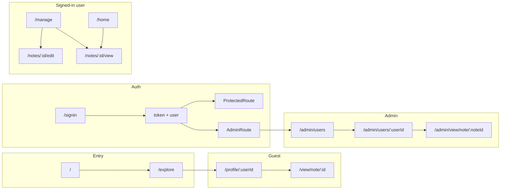

# Edura Notes

A full-stack notes app where users sign in with Google, organize notes in folders, upload PDFs and images (max 10 MB), and view them in a secure viewer (no copy/print). Guests can browse a landing page and explore public profiles and files. Admins can manage users, storage, and curate what appears on the Explore page.

---

## Table of contents

- [Tech stack](#tech-stack)
- [Main features](#main-features)
- [Site structure and routes](#site-structure-and-routes)
- [Page and feature index](#page-and-feature-index)
- [Linking and navigation](#linking-and-navigation)
- [Data flow](#data-flow)
- [Prerequisites](#prerequisites)
- [Install & run](#install--run)
- [Environment variables](#environment-variables)
- [Main functions & implementation](#main-functions--implementation)
- [External services & setup](#external-services--setup)
- [Project structure](#project-structure)
- [Scripts](#scripts)
- [Security (note viewer)](#security-note-viewer)
- [Important points](#important-points)

---

## Tech stack

| Layer    | Stack |
|----------|--------|
| Frontend | React 18, Vite 5, React Router 6, Bootstrap 5, react-pdf (PDF.js) |
| Backend  | Node.js, Express |
| Database | MongoDB (Mongoose) |
| Auth     | Google OAuth 2.0 (google-auth-library), JWT |
| File storage | Cloudinary (new uploads), local `server/uploads/` (legacy) |

---

## Main features

- **Explore (default for guests)** – Root `/` redirects to `/explore`. Public profiles and public files; “Sign in with Google”; sign in via `/signin`.
- **Google Sign-In** – One-click sign-in; JWT stored in client; optional redirect back after login.
- **Home (signed-in)** – Browse notes by folder, search, sort (name/size/date), grid/list view, pagination (10/20/50/100 per page).
- **Manage** – Upload PDF/images (max 10 MB), create/edit folders, move notes, set public/private, pagination.
- **Folders** – Two-level (root + subfolder); filter notes by folder; sidebar on Home and Manage.
- **Secure note viewer** – PDF/images in-app; no copy, no print, no drag; PDF.js worker served from app origin.
- **Public profiles & files** – Users can mark notes public; public profile page shows public notes; anyone can view via `/profile/:userId` and `/view/note/:id`. A profile or note is visible if the owner set it public **or** an admin set "List on Explore" / "List profile on Explore".
- **Explore** – Lists only **admin-curated** content: profiles with "List profile on Explore" and notes with "List on Explore"; separate pagination for Top Contributors and Public Files; search; filter All / Profiles / Notes.
- **Admin panel** – Separate login at `/admin/login`; list users (paginated, search, per-page 10/20/50/100); user detail: storage limit, “List profile on Explore”, per-note “List on Explore”, paginated files; delete users/notes; view any note.
- **Admin Explore curation** – Admin sets "List profile on Explore" (user) and "List on Explore" (per note). Explore page shows only that curated content; public profile and public note view show owner-public **or** admin-listed content.
- **Storage** – Per-user limit (default 50 MB); enforced on upload; admin can change limit per user.
- **Pagination** – Home, Manage, Explore (profiles + files), Admin users list, Admin user detail (files); per-page options 10/20/50/100 where applicable.

---

## Site structure and routes

All routes are defined in `client/src/App.jsx`. Protected routes use `ProtectedRoute`; admin routes use `AdminRoute` (and `AdminLayout` except for the admin note viewer).

### Public / unauthenticated

| Path | Renders | Layout | Notes |
|------|--------|--------|--------|
| `/` | Redirect → `/explore` | — | Always |
| `/explore` | Explore | Layout | Default landing; hero, search, Top Contributors, Public Files |
| `/signin` | SignIn | Layout | Google + email sign-in/sign-up tabs; `state.mode === 'signup'`; link to Explore |
| `/signup` | Redirect → `/signin` with `state.mode: 'signup'` | — | — |
| `/profile/:userId` | PublicProfile | Layout | Public profile: user card, search, sort, grid/list, notes by folder |
| `/view/note/:id` | PublicNoteView | **No** (full-screen viewer) | Secure viewer; zoom; Back to profile / Home |
| `/admin/login` | AdminLogin | **No** (standalone dark card) | Google + email/password sign-in; "Back to main site" → `/explore` |

### Protected (signed-in, non-admin)

| Path | Renders | Layout | Notes |
|------|--------|--------|--------|
| `/home` | Homepage | Layout | Sidebar FolderList (readOnly), search, sort, view mode, pagination, NoteCard (View only) |
| `/manage` | Manage | Layout | Upload section, storage bar, FolderList (editable), notes grid/list, NoteCard (View/Edit/Delete) |
| `/notes/new` | Redirect → `/manage` | — | — |
| `/notes/:id/view` | FullScreenPdfView | **No** | Secure viewer; zoom; Close → `location.state.from` or `/home` |
| `/notes/:id/edit` | EditNote | Layout | Breadcrumb Manage; form: title, description, folder, visibility, replace file; Save/Cancel/Delete (ConfirmModal) |

### Dashboard redirect

| Path | Behavior |
|------|----------|
| `/dashboard` | If authenticated → `/home`; else → `/explore` |

### Admin (requires `user.role === 'admin'`)

`AdminRoute`: loading → spinner; no user → redirect `/admin/login`; not admin → redirect `/home`. For `/admin/view/note/:noteId` it renders only the page (no AdminLayout). All other admin paths render `AdminLayout` + page.

| Path | Renders | Layout | Notes |
|------|--------|--------|--------|
| `/admin` | Redirect → `/admin/dashboard` | — | — |
| `/admin/dashboard` | AdminDashboard | AdminLayout | Stats: total users, notes, storage, plus paginated user table; "View files" → user detail |
| `/admin/users` | AdminUsers | AdminLayout | Table: name, email, notes count, storage, created; search; per-page 10/20/50/100; "View files" → user detail |
| `/admin/users/:userId` | AdminUserDetail | AdminLayout | User card, delete user (unless self), storage limit (MB + Save), "List profile on Explore", paginated notes with "List on Explore" per note, View note link, delete selected notes |
| `/admin/view/note/:noteId` | AdminNoteView | **No** (full-screen) | Secure viewer; "List on Explore" checkbox; zoom; Back to user |

**AdminLayout:** Sidebar (Dashboard, Users), logout → `/admin/login`, topbar with user name.

### Catch-all

| Path | Behavior |
|------|----------|
| `*` | Redirect → `/` (then `/explore`) |

---

## Page and feature index

- **SignIn** – Google (if `VITE_GOOGLE_CLIENT_ID`) and email/password sign-in and sign-up tabs; redirect after login to `location.state.from` or `/home`; link "Explore public files and profiles" → `/explore`.
- **Explore** – Hero; single search with filter (All / Profiles / Notes); Top Contributors from `GET /api/public/explore/users` (paginated, per-page 4/8/12/20/50/100); Public Files from `GET /api/public/explore/notes` (sort: name/size/time, per-page same, exclude current user if signed in); cards link to `/profile/:userId` and `/view/note/:id`. **Visibility:** Explore shows only admin-curated content (`listedOnExplore` for notes, `profileListedOnExplore` for users).
- **Homepage** – FolderList sidebar (readOnly, multi-select, cascading); search (button + Enter); per-page 10/20/50/100; SortBySelect (name/size/time); ViewModeToggle (grid/list); notes grouped by folder/uncategorized; NoteCard View only; view mode and sort persisted in localStorage; empty state "Go to Manage"; pagination "Showing X–Y of Z".
- **Manage** – Same sidebar (readOnly=false: add/rename/delete folders); storage card (used/limit MB, progress bar, warning at limit); upload form: dropzone + file input, title, FolderTreeSelect, visibility (Private/Public), description, Upload/Clear; file validation 10 MB, PDF/images; notes list with sort, view mode, pagination; NoteCard with View, Edit, Delete (ConfirmModal); empty state scroll to upload.
- **EditNote** – Load note + folders; form: title, description, folder, visibility (Private/Public), optional file replace; beforeunload when dirty; Save (PUT with or without file), Cancel → `/manage`, Delete → ConfirmModal then redirect `/manage`.
- **FullScreenPdfView** – Fetches note by id; bar: title, zoom (0.5–3, step 0.25), Close; SecureNoteViewerLazy with `noteId`; no Layout; Escape → back; context menu/drag disabled.
- **PublicProfile** – `GET /api/public/profile/:userId`; profile card (avatar/initials, name); Back to Explore; search; SortBySelect; ViewModeToggle; notes by folder (tree); cards link to `/view/note/:id`; empty "Browse Explore". **Visibility:** Profile visible if user has any note with `isPublic` or `listedOnExplore`, or `profileListedOnExplore`.
- **PublicNoteView** – `GET /api/public/notes/:id`; full-screen viewer; zoom; Back to profile or Home; no Layout; Escape → back. **Visibility:** Note visible if `isPublic` or `listedOnExplore`.
- **AdminDashboard** – `GET /api/admin/stats` and `GET /api/admin/users`; three stat cards plus full paginated user list.
- **AdminUsers** – `GET /api/admin/users`; search by name/email; per-page 10/20/50/100; table with "View files" → user detail.
- **AdminUserDetail** – `GET /api/admin/users/:userId`; storage limit (MB) + Save; "List profile on Explore" toggle; notes table with per-note "List on Explore", View note → `/admin/view/note/:noteId`; pagination; delete selected notes (modal); delete user (modal, disabled for self).
- **AdminNoteView** – `GET /api/admin/notes/:noteId`; full-screen viewer; "List on Explore" checkbox; zoom; Back to user; ErrorBoundary around viewer.

---

## Linking and navigation

- **Layout header (main site):** Brand → `/` (if authenticated) or `/explore`; when signed in: Home → `/home`, Manage → `/manage`, Explore → `/explore`, Public profile → `/profile/:userId`, Sign out (→ `/`); when guest: Explore → `/explore`, Sign In → `/signin`, Sign Up → `/signin` with `state.mode: 'signup'`.
- **Layout footer:** Quick links to Explore, Sign In, Home, Manage; placeholder links for Privacy Policy, Terms of Service, Help Center.
- **Cross-page flows:** Explore → profile card "View Profile" → `/profile/:userId` → note "View" → `/view/note/:id`; Manage → NoteCard "View" → `/notes/:id/view`, "Edit" → `/notes/:id/edit`; EditNote breadcrumb and Cancel → `/manage`; Admin Users → "View files" → `/admin/users/:userId` → "View" on note → `/admin/view/note/:noteId`; AdminNoteView "Back to user" → `/admin/users/:userId`.

---

## Data flow



---

## Prerequisites

- **Node.js** (v18+ recommended)
- **MongoDB** (local or remote; e.g. `mongod` or Atlas)
- **Google Cloud Console** – OAuth 2.0 Web client ID for Sign-In
- **Cloudinary** (optional but recommended) – Cloud name, API key, API secret for file uploads

---

## Install & run

### 1. Clone and install dependencies

```bash
# From project root
cd server
npm install

cd ../client
npm install
```

The client `postinstall` script copies the PDF.js worker from `node_modules` to `client/public/pdf.worker.min.mjs` so the viewer works without loading from a CDN.

### 2. Environment files

**Server:** Copy `server/.env.example` to `server/.env` and set at least:

- `MONGODB_URI` – MongoDB connection string (e.g. `mongodb://localhost:27017/notes-app`)
- `JWT_SECRET` – Secret for signing JWTs
- `PORT` – Server port (default `5001`)
- `GOOGLE_CLIENT_ID` – Google OAuth 2.0 Web client ID
- `CLOUDINARY_CLOUD_NAME`, `CLOUDINARY_API_KEY`, `CLOUDINARY_API_SECRET` – For uploads (see [External services](#external-services--setup))
- `ADMIN_EMAIL` – Google account email that gets admin role

**Client:** Copy `client/.env.example` to `client/.env` and set:

- `VITE_GOOGLE_CLIENT_ID` – Same value as server `GOOGLE_CLIENT_ID`

### 3. Run MongoDB

Ensure MongoDB is running (e.g. start `mongod` or use a hosted URI in `MONGODB_URI`).

### 4. Start server and client

**Terminal 1 – server:**

```bash
cd server
npm run dev
```

Server runs at `http://localhost:5001` (or your `PORT`). It serves the API and connects to MongoDB.

**Terminal 2 – client:**

```bash
cd client
npm run dev
```

Client runs at `http://localhost:5173`. Vite proxies `/api` to the server.

### 5. Production build & Hosting

For detailed instructions on deploying the server (Vercel/Railway/Render) and client (Vercel/Netlify/Cloudflare), setting up external services, and linking the frontend and backend, please see the **[Hosting Guide (hosting.md)](hosting.md)**.

---

## Environment variables

### Server (`server/.env`)

| Variable | Required | Description |
|----------|----------|-------------|
| `MONGODB_URI` | Yes | MongoDB connection string (e.g. `mongodb://localhost:27017/notes-app`) |
| `JWT_SECRET` | Yes | Secret used to sign JWT tokens |
| `PORT` | No | Server port (default `5001`) |
| `CLIENT_ORIGIN` | No | Allowed CORS origin for production (e.g. `https://your-app.com`) |
| `GOOGLE_CLIENT_ID` | Yes* | Google OAuth 2.0 Web application client ID |
| `CLOUDINARY_CLOUD_NAME` | Yes* | Cloudinary cloud name |
| `CLOUDINARY_API_KEY` | Yes* | Cloudinary API key |
| `CLOUDINARY_API_SECRET` | Yes* | Cloudinary API secret (keep server-side only) |
| `ADMIN_EMAIL` | No | Email used when seeding admin user (can log in with password via `/admin/login`) |

\*Required for full functionality (Sign-In and uploads).

### Client (`client/.env`)

| Variable | Required | Description |
|----------|----------|-------------|
| `VITE_API_URL` | Yes (prod) | Full URL of the hosted backend. Leave empty for local dev to use Vite proxy. |
| `VITE_GOOGLE_CLIENT_ID` | Yes* | Same as server `GOOGLE_CLIENT_ID` for Google Sign-In button |

---

## Main functions & implementation

### Authentication

- **Google Sign-In:** Client loads Google Identity Services, sends ID token to `POST /api/auth/google`; server validates with `google-auth-library`, creates/finds user, returns JWT and user. Client stores token and user in memory (and optionally localStorage) via `AuthContext`.
- **Protected routes:** `ProtectedRoute` checks `AuthContext`; if not authenticated, redirects to `/` with `state.from` so user returns after login.
- **Admin:** `AdminRoute` checks JWT and `user.role === 'admin'`; admin role is set when `user.email === process.env.ADMIN_EMAIL` (see `authRoutes`).

**Implementing auth elsewhere:** Use `AuthContext` (`useAuth()`) for `user`, `isAuthenticated`, `setToken`, `signOut`. Call `api()` from `client/src/api/client.js` which sends `Authorization: Bearer <token>`. `ToastContext` (`addToast`) is used for upload success and error feedback; `ConfirmModal` is used for delete confirmation on NoteCard and EditNote.

### Notes & folders

- **List notes:** `GET /api/notes?page=1&limit=10&folderIds=...&search=...` (auth). Used by Home and Manage with pagination.
- **Upload:** `POST /api/notes` (multipart: file, title, description, folderId, isPublic). Multer (10 MB limit) then Cloudinary or legacy disk; note saved in MongoDB.
- **Folders:** `GET/POST/PUT/DELETE /api/folders` (auth). Two-level hierarchy; used by `FolderList` and Manage.
- **Edit/delete note:** `PUT /api/notes/:id`, `DELETE /api/notes/:id` (auth). Used by Manage and EditNote page.

**Implementing notes elsewhere:** Reuse `api()` and the same query params; pagination is `page` and `limit`; filter by `folderIds` (comma-separated, use `null` for uncategorized) and `search`.

### Public & Explore

- **Explore notes:** `GET /api/public/explore/notes?page=1&limit=10&search=...&excludeUserId=...&sortBy=...` – returns only notes with `listedOnExplore: true` (admin-curated); paginated.
- **Explore users:** `GET /api/public/explore/users?page=1&limit=10&search=...` – returns only users with `profileListedOnExplore: true` (admin-curated); paginated.
- **Public profile:** `GET /api/public/profile/:userId` – profile viewable if user has explore-visible notes or `profileListedOnExplore`; returns user + folders + notes (isPublic or listedOnExplore).
- **Public note:** `GET /api/public/notes/:id` and `GET /api/public/notes/:id/file` – note viewable if `isPublic` or `listedOnExplore`.

**Implementing public/explore elsewhere:** Call `/api/public/...` without auth; same `page`/`limit`/`search` for pagination and search.

### Admin

- **Users list:** `GET /api/admin/users?page=1&limit=10&search=...` – paginated, with note count and storage.
- **User detail:** `GET /api/admin/users/:userId?notesPage=1&notesLimit=10` – user, storage, paginated notes; `PUT /api/admin/users/:userId` for `storageLimitBytes` and `profileListedOnExplore`.
- **Note listing:** `PATCH /api/admin/notes/:id` body `{ listedOnExplore: true/false }` – toggles “List on Explore” for that note.
- **Delete:** `DELETE /api/admin/users/:userId`, `DELETE /api/admin/notes` (body `noteIds`) – cascade delete as needed.

**Implementing admin elsewhere:** All under `/api/admin/*`; use same JWT; require `role === 'admin'` in your UI and via `AdminRoute`.

### PDF viewer

- **Component:** `SecureNoteViewer` (and lazy `SecureNoteViewerLazy`) use `react-pdf` (PDF.js). Worker is loaded from the app origin: `public/pdf.worker.min.mjs` (copied from `pdfjs-dist` in postinstall).
- **Config:** `pdfjs.GlobalWorkerOptions.workerSrc` set to `${base}pdf.worker.min.mjs` so it never loads from unpkg and works for guests on the landing page.

**Implementing viewer elsewhere:** Use `SecureNoteViewer` with `publicNoteId`/`noteId`/`adminNoteId` or `pdfBlobUrl`; ensure `client/public/pdf.worker.min.mjs` exists (run `npm install` in client so postinstall runs).

### File upload limit (10 MB)

- **Server:** `server/middleware/uploadMiddleware.js` – Multer `limits.fileSize = 10 * 1024 * 1024`.
- **Client:** `client/src/pages/Manage.jsx` – `MAX_FILE_SIZE = 10 * 1024 * 1024`; validation message “File must be 10 MB or smaller”; UI text “Max 10 MB”.

**Changing the limit:** Update both the Multer limit and the client constant/message so they match.

---

## External services & setup

### MongoDB

- **Purpose:** Stores users, folders, notes metadata, and (if not using Cloudinary) references to files.
- **Setup:** Install MongoDB locally or create a cluster at [MongoDB Atlas](https://www.mongodb.com/cloud/atlas). Set `MONGODB_URI` in `server/.env` (e.g. `mongodb://localhost:27017/notes-app` or Atlas connection string).

### Google Sign-In (OAuth 2.0)

- **Purpose:** Sign-in and admin identity (admin role by email).
- **Setup:**
  1. Go to [Google Cloud Console](https://console.cloud.google.com/) → APIs & Services → Credentials.
  2. Create OAuth 2.0 Client ID, type “Web application”.
  3. Add authorized JavaScript origins (e.g. `http://localhost:5173`, your production URL).
  4. Copy the Client ID into `GOOGLE_CLIENT_ID` (server) and `VITE_GOOGLE_CLIENT_ID` (client).

### Cloudinary

- **Purpose:** Store uploaded files (PDF/images); delivery via CDN.
- **Setup:**
  1. Sign up at [Cloudinary](https://cloudinary.com) and open Dashboard → Settings → Security (API Keys).
  2. Set in `server/.env`: `CLOUDINARY_CLOUD_NAME`, `CLOUDINARY_API_KEY`, `CLOUDINARY_API_SECRET`.
  3. Never expose the API secret to the client. Existing “legacy” notes without Cloudinary URLs are still served from `server/uploads/` if the app supports it.

---

## Project structure

```
Notes Handling/
├── client/                 # React (Vite) frontend
│   ├── public/
│   │   └── pdf.worker.min.mjs   # PDF.js worker (same-origin)
│   ├── src/
│   │   ├── api/            # API client (fetch + auth header)
│   │   ├── components/     # Layout, ProtectedRoute, AdminRoute, AdminLayout,
│   │   │                   # FolderList, FolderTreeSelect, NoteCard, SortBySelect,
│   │   │                   # ViewModeToggle, SecureNoteViewer, SecureNoteViewerLazy,
│   │   │                   # ConfirmModal, ErrorBoundary
│   │   ├── context/        # AuthContext, ToastContext
│   │   ├── pages/          # Explore, SignIn, Homepage, Manage, EditNote, ViewNote,
│   │   │                   # FullScreenPdfView, PublicProfile, PublicNoteView, AdminLogin,
│   │   │                   # admin/ (AdminDashboard, AdminUsers, AdminUserDetail, AdminNoteView)
│   │   ├── styles/         # edura.css (theme)
│   │   └── utils/          # folderTree, sortNotes, avatar
│   ├── .env.example
│   ├── package.json
│   └── vite.config.js
├── server/                 # Express backend
│   ├── middleware/         # auth, admin, upload (Multer)
│   ├── models/             # User, Note, Folder
│   ├── routes/             # authRoutes, folderRoutes, noteRoutes, publicRoutes, adminRoutes
│   ├── scripts/            # seedAdminUser, seedDemoUser
│   ├── .env.example
│   └── package.json
└── README.md
```

---

## Scripts

### Server (`server/`)

| Script | Command | Description |
|--------|--------|-------------|
| dev | `npm run dev` | Start server with `--watch` |
| start | `npm start` | Start server (production) |
| seed:admin | `npm run seed:admin` | Create/update admin user (uses `ADMIN_EMAIL`) |
| seed:demo | `npm run seed:demo` | Create demo user (see script) |

### Client (`client/`)

| Script | Command | Description |
|--------|--------|-------------|
| dev | `npm run dev` | Start Vite dev server (proxy `/api` to server) |
| build | `npm run build` | Build for production into `dist/` |
| preview | `npm run preview` | Serve `dist/` locally |
| postinstall | (runs after `npm install`) | Copy PDF.js worker to `public/pdf.worker.min.mjs` |

---

## Security (note viewer)

- **No copy/download:** Right-click and drag disabled on the viewer wrapper.
- **No print:** Print CSS hides content and shows a short message.
- **Screenshot:** Cannot be fully prevented; deterrent message can be shown.

---

## Important points

1. **PDF viewer:** The worker must be served from your app. The client copies it to `public/pdf.worker.min.mjs` on install; do not remove that file or the postinstall script.
2. **Admin:** Only the account whose email matches `ADMIN_EMAIL` can access `/admin`. Sign in at `/admin/login` with that Google account.
3. **Explore visibility:** The Explore page shows only admin-curated content (notes with "List on Explore", profiles with "List profile on Explore"). Public profile and public note view show owner-public or admin-listed content.
4. **Upload limit:** 10 MB per file (client and server); change in `uploadMiddleware.js` and Manage.jsx if you need a different limit.
5. **CORS:** For production, set `CLIENT_ORIGIN` in `server/.env` to your frontend URL so the API only accepts requests from that origin.
6. **Audit:** See [AUDIT.md](AUDIT.md) for project logic, abandoned-code list, and a checklist for cleanup and doc alignment.
